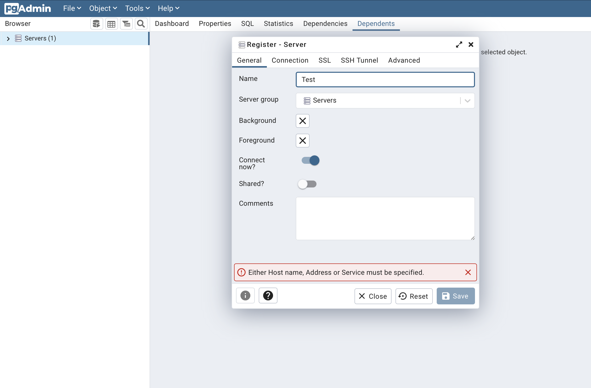
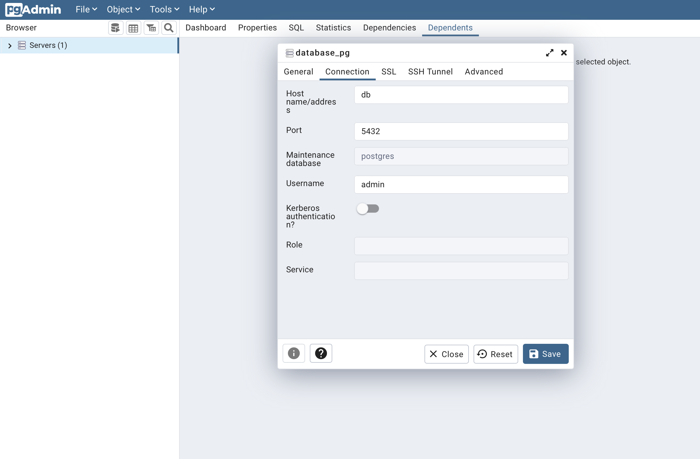

<h1> Corsi di Formazione </h1>

A low-code web-based platform for managing business learning courses.

<h2> Why </h2>

This project is a proof of concept for a master's degree thesis in Management Engineering - Digital Business & Analytics, that aims at studying and understanding the advantages, the different approaches and the possible usage of low-code and no-code platforms in business' software development units.

<h2> How it works </h2>

This app is built using <a href="https://github.com/appsmithorg">Appsmith</a> through Docker (self-hosted) integrated with a PostgreSQL database and managed via PgAdmin 4. Every software is installed through Docker.

<h2> How to install </h2>

Docker <b>must</b> be installed in your machine.

<ol>
  <li>Download the <a href="https://github.com/GianlucaLostuzzo/thesis_poc/blob/master/docker-compose.yml" target="_blank">docker-compose</a> file</li>
  <li>Open your terminal application</li>
  <li>Move to the folder where the docker-compose.yml file is saved</li>
  <li>Run the command "docker compose up -d"</li>
</ol>

When the installation of the conatiners has finished, follow these steps needed to connect PgAdmin 4 to PostgreSQL:
<ul>
  <li>In your browser navigate to localhost:5050</li>
  <li>Insert the credentials for PgAdmin 4 (you can find them in the docker-compose file)</li>
  <li>Defuault credentials:</li>
  <ul><li>User: admin@admin.com</li><li>Pwd: admin</li></ul>
  <li>Click on Login</li>
</ul>

Right click on "Servers" and click Register - Server 
 

Give a name to the server 
 

Select "Connection" tab and write the name of the service "db", the username and password of PostgreSQL 
 

Click "Save".

After these steps navigate to localhost:80 for activating the UI of Appsmith.  The first time you'll be required to fill out the sign up form:  
 

<h2> Usage </h2>

